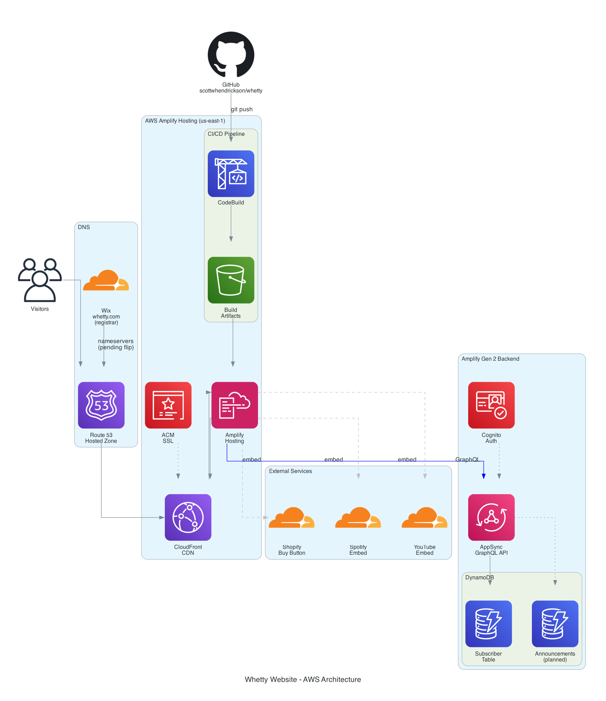

# Whetty Official Website

Official website for recording artist **Whetty** — built on AWS using Amplify Gen 2, React, and Shopify.

🌐 **Live URL (dev):** https://main.d2sm1hk1968jjz.amplifyapp.com  
🌐 **Production URL:** https://whetty.com *(pending nameserver flip)*

---

## AWS Architecture



The Whetty website uses a modern serverless architecture on AWS:

- **DNS**: Route 53 hosted zone for whetty.com (nameservers pending flip from Wix registrar)
- **Hosting**: AWS Amplify Hosting with CloudFront CDN and automatic SSL via ACM
- **CI/CD**: GitHub integration with automatic deployment on every push to main branch
- **Backend**: Amplify Gen 2 (CDK-based) with Cognito auth, AppSync GraphQL API, and DynamoDB
- **External Services**: Shopify Buy Button, Spotify embeds, YouTube embeds

---

## AWS Architecture Diagram

```
                              ┌──────────────────────────────────────────────────────────────────────┐
                              │                          AWS Cloud (us-east-1)                        │
                              │                                                                        │
  ┌──────────┐  nameservers   │  ┌─────────────┐                                                      │
  │   Wix    │───────────────▶│  │  🌐 Route 53 │                                                     │
  │ whetty   │                │  │  Hosted Zone │                                                      │
  │  .com    │                │  └──────┬───────┘                                                      │
  └──────────┘                │         │ DNS records                                                  │
                              │         ▼                                                              │
  ┌──────────┐  git push      │  ┌──────────────────────────────────────────────────────────────────┐ │
  │  GitHub  │───────────────▶│  │  🚀 AWS Amplify Hosting                                          │ │
  │  main    │                │  │                                                                    │ │
  │  branch  │                │  │  ┌─────────────┐    ┌──────────────┐    ┌──────────────────────┐ │ │
  └──────────┘                │  │  │  CodeBuild  │───▶│  S3 Bucket   │───▶│  CloudFront (CDN)    │ │ │
                              │  │  │  CI/CD      │    │  (artifacts) │    │  + ACM SSL cert      │ │ │
                              │  │  └─────────────┘    └──────────────┘    └──────────────────────┘ │ │
                              │  └──────────────────────────────────────────────────────────────────┘ │
                              │                                                                        │
                              │  ┌──────────────────────────────────────────────────────────────────┐ │
                              │  │  ⚙️  Amplify Gen 2 Backend (CDK / CloudFormation)                 │ │
                              │  │                                                                    │ │
                              │  │  ┌──────────────┐    ┌──────────────┐    ┌──────────────────────┐ │ │
                              │  │  │  🔐 Cognito   │    │  📡 AppSync  │    │  🗄️  DynamoDB         │ │ │
                              │  │  │  Identity    │    │  GraphQL API │───▶│  Tables:             │ │ │
                              │  │  │  Pool + User │    │              │    │  - Subscriber        │ │ │
                              │  │  │  Pool        │    │              │    │  - Announcements*    │ │ │
                              │  │  └──────────────┘    └──────────────┘    └──────────────────────┘ │ │
                              │  └──────────────────────────────────────────────────────────────────┘ │
                              └──────────────────────────────────────────────────────────────────────┘

  External Services:
  ┌──────────────┐  ┌──────────────┐  ┌──────────────┐  ┌──────────────┐
  │  🛍️ Shopify   │  │  🎵 Spotify  │  │  ▶️ YouTube   │  │  🎵 Others   │
  │  Buy Button  │  │  Embed       │  │  Embed       │  │  Apple Music │
  │  Storefront  │  │  Artist Page │  │  @whetty88   │  │  SoundCloud  │
  │  API         │  │              │  │              │  │  Tidal etc.  │
  └──────────────┘  └──────────────┘  └──────────────┘  └──────────────┘

  * = planned
```

---

## Project Structure

```
whetty/
├── amplify/                    # Amplify Gen 2 backend (CDK)
│   ├── auth/
│   │   └── resource.ts         # Cognito auth configuration
│   ├── data/
│   │   └── resource.ts         # AppSync + DynamoDB schema
│   └── backend.ts              # Backend entry point
├── frontend/                   # React + Vite frontend
│   ├── public/
│   │   └── whetty_logo.avif    # Site logo / favicon
│   └── src/
│       ├── components/
│       │   ├── MerchSection.jsx    # Shopify Buy Button
│       │   └── SubscribeForm.jsx   # Email subscribe form
│       ├── hooks/
│       │   └── useSubscribe.js     # DynamoDB subscribe hook
│       ├── pages/
│       │   ├── Home.jsx            # Hero, featured release, email signup
│       │   ├── Music.jsx           # Spotify embed + streaming links
│       │   ├── Videos.jsx          # YouTube embeds
│       │   ├── Announcements.jsx   # Blog-style posts
│       │   ├── Shop.jsx            # Shopify merch (live May 8th)
│       │   └── Tour.jsx            # Tour dates + notify signup
│       ├── App.jsx                 # Root component + navigation
│       ├── App.css                 # Global styles
│       └── main.jsx                # Entry point + Amplify config
├── python/                     # Python scripts and utilities
│   ├── generate_architecture_diagram.py  # AWS diagram generator
│   ├── requirements.txt        # Python dependencies
│   ├── setup_venv.sh          # Virtual environment setup script
│   └── venv/                  # Virtual environment (gitignored)
├── docs/                       # Project documentation
│   ├── architecture.png        # AWS architecture diagram
│   ├── hosted_zone_setup.md
│   ├── hosted_zone_creation_log.md
│   ├── frontend_setup.md
│   └── shopify_go_live_checklist.md
├── amplify.yml                 # Amplify CI/CD build config
└── README.md                   # This file
```

---

## Pages

| Page | Route | Status | Description |
|------|-------|--------|-------------|
| Home | `/` | ✅ Live | Hero, featured release, email signup, social links |
| Music | `/music` | ✅ Live | Spotify embed, streaming platform links, discography |
| Videos | `/videos` | ✅ Live | YouTube embeds from @whetty88 |
| Announcements | `/announcements` | ✅ Live | Blog-style posts (CMS coming) |
| Shop | `/shop` | ⏳ May 8th | Shopify Buy Button (countdown until launch) |
| Tour | `/tour` | ⏳ Coming Soon | Tour dates + email notify signup |

---

## Making Changes & Deploying

### Workflow
Every push to the `main` branch on GitHub automatically triggers a deployment via AWS Amplify CI/CD. No manual deployment steps needed.

```bash
# 1. Make your changes locally
# 2. Test on localhost:5173
cd frontend && npm run dev

# 3. Commit and push
git add -A
git commit -m "Description of changes"
git push

# 4. Monitor deployment
# https://console.aws.amazon.com/amplify/home?region=us-east-1#/d2sm1hk1968jjz
```

### Python Scripts Setup
The project includes Python scripts for generating diagrams and other utilities. These require a Python virtual environment and Graphviz.

#### Prerequisites
```bash
# Install Graphviz (required for diagram generation)
brew install graphviz
```

#### One-time Setup
```bash
# Run the setup script (creates venv and installs dependencies)
bash python/setup_venv.sh
```

#### Using Python Scripts
```bash
# Activate the virtual environment
source python/venv/bin/activate

# Run your Python script (e.g., generate architecture diagram)
python python/generate_architecture_diagram.py

# Deactivate when done
deactivate
```

#### Adding New Python Dependencies
```bash
# Activate venv first
source python/venv/bin/activate

# Install new package
pip install package-name

# Update requirements.txt
pip freeze > python/requirements.txt

# Deactivate
deactivate
```

### Adding YouTube Videos
Edit `frontend/src/pages/Videos.jsx`:
```js
const VIDEOS = [
  { id: 'VIDEO_ID_HERE', title: 'Video Title' },
  // add more here
]
```
The video ID is the part after `?v=` in the YouTube URL.

### Adding Streaming Platform Links
Edit `frontend/src/pages/Music.jsx` and update the `STREAMING_PLATFORMS` object with real URLs.

### Adding Announcements
Currently static in `frontend/src/pages/Announcements.jsx`. A DynamoDB-backed CMS is planned — posts will be manageable without code changes.

### Updating Shopify Products
1. Add/update products in the [Shopify Admin](https://admin.shopify.com/store/whettys-store)
2. Generate a new Buy Button embed code
3. Update the product ID in `frontend/src/components/MerchSection.jsx`

### Changing Colors / Theme
Edit CSS variables in `frontend/src/App.css`:
```css
:root {
  --accent: #c8b89a;       /* khaki - primary accent color */
  --accent-hover: #d4c4aa; /* lighter khaki for hover states */
  --bg-primary: #0a0a0a;   /* main background */
  --text-primary: #ffffff; /* primary text */
}
```

---

## Backend Schema (DynamoDB via AppSync)

### Subscriber Table
Stores email signups from the Home page and Tour page.

| Field | Type | Description |
|-------|------|-------------|
| id | String | Auto-generated UUID |
| email | String | Subscriber email address |
| source | String | Where they signed up (`home`, `tour`) |
| subscribedAt | String | ISO timestamp |

### Planned Tables
- **Announcement** - Blog posts manageable via admin panel
- **TourDate** - Tour dates and ticket links

---

## Environment & AWS Resources

| Resource | ID / Value |
|----------|-----------|
| Amplify App ID | `d2sm1hk1968jjz` |
| Amplify URL | `https://main.d2sm1hk1968jjz.amplifyapp.com` |
| Route 53 Hosted Zone | `Z0074500Z0GR9W4SG049` |
| AWS Region | `us-east-1` |
| AWS Account | `808236751695` |
| GitHub Repo | `https://github.com/scottwhendrickson/whetty` |
| Shopify Store | `https://admin.shopify.com/store/whettys-store` |

### Route 53 Nameservers (for Wix)
When ready to go live, update nameservers in Wix to:
```
ns-1538.awsdns-00.co.uk
ns-1381.awsdns-44.org
ns-322.awsdns-40.com
ns-898.awsdns-48.net
```

---

## Go-Live Checklist

- [ ] Configure Shopify Payments (bank account)
- [ ] Add real products with photos and pricing
- [ ] Test full purchase flow
- [ ] Add custom domain `whetty.com` in Amplify Console
- [ ] Flip nameservers in Wix to Route 53
- [ ] Verify SSL certificate provisioned
- [ ] Smoke test whetty.com end to end

See `docs/shopify_go_live_checklist.md` for full details.

---

## Launch Timeline

| Date | Milestone |
|------|-----------|
| April 25, 2026 | Initial launch — Home, Music, Videos, Announcements, Tour |
| May 8, 2026 | Shop goes live with POP¡ EP release |
| TBD | Flip nameservers, whetty.com goes live |

---

## Tech Stack

| Layer | Technology |
|-------|-----------|
| Frontend | React 18 + Vite |
| Styling | CSS Variables (no framework) |
| Hosting | AWS Amplify Hosting + CloudFront |
| Backend | AWS Amplify Gen 2 (CDK) |
| Auth | AWS Cognito |
| API | AWS AppSync (GraphQL) |
| Database | AWS DynamoDB |
| DNS | AWS Route 53 |
| E-commerce | Shopify Buy Button + Storefront API |
| CI/CD | GitHub → AWS Amplify (auto-deploy on push) |
| Domain | whetty.com (registered at Wix) |
